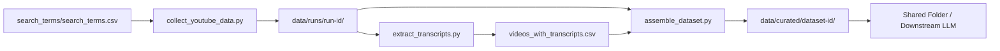
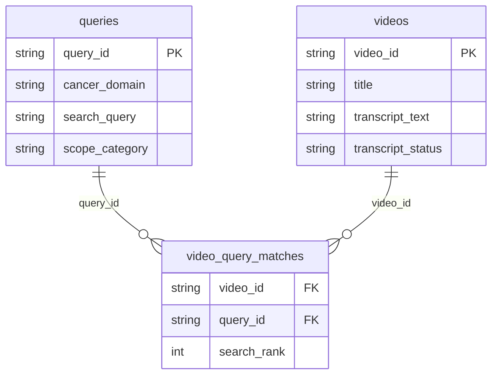

# Cancer Screening Video Data Pipeline Guide

---

## 1. Overall Goal

Design and run a reproducible data pipeline that turns patient-oriented cancer screening search terms into a structured YouTube video dataset for downstream LLM evaluation and ranking.

**Project flow:**

```
Search Terms → YouTube Retrieval → Structured Dataset → LLM Evaluation → Ranking
```

**Responsibilities covered by this pipeline:**

| Area |
|------|
| Data collection |
| Metadata structuring |
| Transcript extraction |
| Handoff packaging |

---

## 2. Three-Step Pipeline

Think of the pipeline as three factory steps:

| Step | Script | YouTube Data API? | Output |
|------|--------|-------------------|--------|
| 1. Collect metadata | `collect_youtube_data.py` | Yes | `data/runs/<run-id>/` |
| 2. Extract transcripts | `extract_transcripts.py` | No | `videos_with_transcripts.csv` |
| 3. Assemble handoff | `assemble_dataset.py` | No | `data/curated/<dataset-id>/` |

### Directory design

| Directory | Purpose |
|-----------|---------|
| `data/runs/` | Immutable raw runs — never overwritten, supports reproducibility |
| `data/curated/` | Handoff packages for teammates |



---

### Step 1: `collect_youtube_data.py` — Collect Video Metadata

**Input:** `search_terms/search_terms.csv`

```csv
cancer_domain,search_query,contributor,source,scope_category
lung,Who qualifies for LDCT...,Xinhui,WTO,Pre-screening education
```

**What it does:**

#### Phase A — Search per query

1. Call YouTube **Search API** (`search.list`) for each search term
2. Retrieve Top N videos (full corpus uses `--top-n 20`)
3. Record each video's **search rank** under that query

Writes **`video_query_matches.csv`**: one row per query–video pair.

#### Phase B — Fetch video details

Deduplicated `video_id`s → **Videos API** (`videos.list`) for title, description, duration, language, engagement, and `caption_available`.

#### Phase C — Fetch channel details

**Channels API** for channel name, subscriber count, and related metadata.

#### Phase D — Dedup and quality flags

| Behavior |
|----------|
| Cross-query dedup: one row per `video_id` in `videos.csv` |
| Near-duplicate flag: same normalized title + channel → `near_duplicate_candidate=True` (flagged for review, **not auto-deleted**) |

**Outputs (`data/runs/<run-id>/`):**

| File | Description |
|------|-------------|
| `queries.csv` | One row per search term |
| `video_query_matches.csv` | Query–video pairs with rank |
| `videos.csv` | Deduplicated video table |
| `collection_errors.csv` | API failures |
| `dataset_qa.json` | Summary statistics |
| `run_manifest.json` | Config, input checksum, quota estimate |

**Important notes:**

| Note |
|------|
| No transcript text at this stage |
| `transcript_status` only reflects YouTube's caption flag, not actual retrieval |
| ~100 quota units per search query |
| Use `--start-at`, `--max-queries`, and different `--run-id` for batched collection |

**Example command:**

```bash
python3 collect_youtube_data.py \
  --input search_terms/search_terms.csv \
  --top-n 10 \
  --run-id full-corpus-001
```

---

### Step 2: `extract_transcripts.py` — Extract Transcripts

**Why a separate step?**

| Reason |
|--------|
| YouTube Data API does **not** allow downloading captions for videos you do not own |
| Uses **`youtube-transcript-api`** (unofficial public caption client) |
| Does not consume Data API quota |

**Input / output:**

| | File |
|---|------|
| Input | `videos.csv` |
| Output | `videos_with_transcripts.csv`, `transcript_errors.csv` |

**Per-video logic:**

```
1. Try English captions (en, en-US, en-GB)
   ↓ success → transcript_status = public_transcript_retrieved
   ↓ fail
2. (Optional) --translate-to-en → try translating another language
   ↓ success → translated_public_transcript
   ↓ fail → transcript_unavailable → write to transcript_errors.csv
```

**Recommended flags for full corpus:**

```bash
caffeinate -i -m -s python3 -u extract_transcripts.py \
  --input data/runs/full-corpus-001/videos.csv \
  --resume --batch-size 50 --delay-seconds 5 \
  --output data/runs/full-corpus-001/videos_with_transcripts.csv \
  --error-output data/runs/full-corpus-001/transcript_errors.csv
```

| Flag | Purpose |
|------|---------|
| `--resume` | Skip videos already written to output |
| `--batch-size 50` | Process 50 outstanding videos per run |
| `--delay-seconds 5` | Random wait 5–10 s between videos to reduce IP block risk |
| `caffeinate` | Keep process alive when screen sleeps |
| `-u` | Unbuffered log output |

**Do not use `--translate-to-en` unless needed:**

| Reason |
|--------|
| Adds a second request per failed video |
| Increases rate-limit / IP block risk |

**Safety mechanisms:**

| Mechanism |
|-----------|
| Flush each row immediately — interrupted runs keep progress |
| Stop on IP block (`IpBlocked`, etc.) |
| Stop after 15 consecutive failures (likely rate limit, not video-specific) |
| 20 s timeout per request |

**Key transcript fields:**

| Field | Description |
|-------|-------------|
| `transcript_text` | Raw caption text |
| `transcript_text_normalized` | Whitespace-normalized text for LLM input |
| `transcript_status` | retrieved / unavailable / translated |
| `transcript_is_generated` | Whether captions are auto-generated |
| `transcript_language` | Caption language |

---

### Step 3: `assemble_dataset.py` — Merge and Package

Offline merge of `data/runs/` into `data/curated/` for teammate handoff. No API calls.

**Merge logic:**

| Step |
|------|
| Dedupe videos by `video_id`, keep latest `collected_at` |
| Dedupe matches by `(video_id, normalized_search_query)` |
| Dedupe queries by `(cancer_domain, normalized_search_query)` |
| Add `source_run_ids`, `search_query_count`, `search_queries` JSON |
| Write `dataset_manifest.json` |

**Note:** `assemble_dataset.py` does **not** copy transcript files automatically. After extraction completes:

```bash
python3 assemble_dataset.py --run-ids full-corpus-001 --dataset-id full-corpus-v1

cp data/runs/full-corpus-001/videos_with_transcripts.csv data/curated/full-corpus-v1/
cp data/runs/full-corpus-001/transcript_errors.csv data/curated/full-corpus-v1/
```

---

## 3. Data Model

### Core tables and joins



### Which file to use

| Use case | Primary table | Join with |
|----------|---------------|-----------|
| LLM evaluation | `videos_with_transcripts.csv` | `video_query_matches.csv` |
| Ranking per query | `video_query_matches.csv` | `videos_with_transcripts.csv` |
| Metadata only (no transcript yet) | `videos.csv` | `video_query_matches.csv` |

### Example: rank videos for one query

1. Filter `video_query_matches.csv` by `query_id`
2. Sort by `search_rank` (YouTube's original order)
3. Join `videos_with_transcripts.csv` on `video_id` for title and transcript
4. Rank **per query** — the same video may appear under multiple queries

### Field groups

#### LLM evaluation (required)

`video_id`, `title`, `description`, `duration_seconds`, `default_language`, `default_audio_language`, `transcript_text`, `transcript_status`

#### Ranking and presentation

`video_id`, `url`, `title`, `channel_title`, `video_published_at`, `duration_seconds`, plus query context from `video_query_matches.csv`

#### Descriptive only — not quality labels

`view_count`, `like_count`, `comment_count`

#### Data quality

`caption_available`, `near_duplicate_candidate`, `transcript_status`, `transcript_retrieval_error`

---

## 4. Current Project Status

### Two datasets

| | POC Sample | Full Corpus |
|---|------------|-------------|
| **Curated path** | `data/curated/poc-handoff-v1/` | `data/curated/full-corpus-v1/` |
| **Run path** | `data/runs/poc-handoff-001/` | `data/runs/full-corpus-001/` |
| **Queries** | 10 | 50 |
| **Unique videos** | 46 | 785 |
| **Query–video matches** | 50 | 1,000 |
| **Transcripts** | Complete — **38/46 (82.6%)** | **Paused (IP block)** — **486/785 (62%)** processed, **458 retrieved (94.2%)** |
| **Primary table** | `videos_with_transcripts.csv` | `videos_with_transcripts.csv` (partial, synced) |

### POC sample (`poc-handoff-v1/`) — ready for handoff

| File | Status |
|------|--------|
| `videos_with_transcripts.csv` | Complete |
| `video_query_matches.csv` | Complete |
| `queries.csv` | Complete |
| `transcript_errors.csv` | 8 failures |
| `dataset_qa.json` | Complete |
| `DATA_CONTRACT.md` | Included |

Teammates can use this now for schema validation, join logic, and LLM prompt prototyping.

### Full corpus (`full-corpus-001` / `full-corpus-v1`)

| Item | Status |
|------|--------|
| Metadata collection | Complete |
| `full-corpus-v1/` metadata handoff | Complete |
| Transcript extraction | **Paused** at `2d4H8eeEG-Q` due to YouTube **IP block** |
| `videos_with_transcripts.csv` in curated | **Synced** — 486 rows (458 with transcript) |
| Latest snapshot | **486/785 processed**, **458 retrieved**, **28 unavailable**, **299 outstanding** |
| Projected full-corpus success | ~**740/785 (~94%)** if current rate holds |
| Resume command | Same `--resume`; after block use `--batch-size 30 --delay-seconds 8` |

> **Last updated:** 2026-09-17 (evening). Extraction paused — do not retry until cooldown or network change.

### Recommended upload structure

```
Shared Folder/
├── poc-handoff-v1/      ← POC with transcripts
└── full-corpus-v1/      ← 486/785 partial transcripts (458 ok)
```

### Do not upload

| Item |
|------|
| `.env` (API keys) |
| `Backup-codes-*.txt` |
| Raw `data/runs/` unless teammates need provenance |

---

## 5. Mapping to Project Scope

| Scope requirement | Pipeline implementation |
|-------------------|-------------------------|
| 200 search terms (100 lung + 100 colon) | `search_terms/search_terms.csv` (50 so far) |
| Top N videos per query | `--top-n 10` (final target) |
| Dedup across queries | Dedup in `videos.csv` + `near_duplicate_candidate` |
| Video metadata | `videos.csv` |
| Query context | `video_query_matches.csv`, `scope_category` |
| Transcripts | `extract_transcripts.py` → `videos_with_transcripts.csv` |
| Reproducibility | `run_manifest.json` (input checksum + config) |
| Engagement ≠ quality | Documented in `DATA_CONTRACT.md` |

---

## 6. One-Sentence Summary

`collect` retrieves videos and metadata via the official API → `extract` pulls public captions in batches with resume → `assemble` packages offline handoff → downstream uses **`videos_with_transcripts.csv` + `video_query_matches.csv`** for per-query LLM evaluation and ranking.

---

## 7. Observed Performance (Test Runs)

Based on actual runs through 2026-09-17:

### Collection speed and success

| Metric | POC | Full corpus |
|--------|-----|-------------|
| Queries succeeded | 10/10 (100%) | 50/50 (100%) |
| API errors | 0 | 0 |
| Unique videos | 46 | 785 |
| Cross-query duplicates removed | 4 | 215 |
| Wall time (estimate) | ~2–5 min | ~10–20 min |
| Quota (search only) | ~1,000 units | ~5,000 units |

### Transcript speed and success

**Recommended config:** `--resume --batch-size 50 --delay-seconds 5` (no `--translate-to-en`)

| Metric | POC (early run) | Full corpus (current) |
|--------|-----------------|----------------------|
| Processed | 46/46 | **486/785 (62%)** — paused |
| Retrieved | 38 (82.6%) | **458 (94.2% of processed)** |
| Unavailable | 8 | **28** |
| Outstanding | 0 | **299** (not failed — IP block stopped the run) |
| Per-video time | ~1 s delay (early) | ~7–10 s avg with 5 s delay |
| Per batch (50 videos) | — | ~6–9 min |
| Full corpus (785) estimate | — | ~1.5–2 h pure runtime; spread across batches over days |

**Recent batch success rates:**

| Batch | Retrieved | Rate |
|-------|-----------|------|
| 63 → 113 | 43/50 | 86% |
| 113 → 163 | 49/50 | 98% |
| 163 → 213 | 50/50 | 100% |

**Failure types (full corpus, 486 processed):**

| Error | Count |
|-------|-------|
| `NoTranscriptFound` | 15 |
| `TranscriptsDisabled` | 13 |

**IP block event:**

| Detail |
|--------|
| Block triggered at video `2d4H8eeEG-Q` after 486 videos processed |
| Script stopped correctly — 299 videos not marked as failed |
| Wait several hours or switch network before `--resume` |

**Lessons learned:**

| Lesson |
|--------|
| Do **not** use `--translate-to-en` on English-heavy corpora — caused 0% success in one run |
| YouTube `caption_available=true` is only 22.8% (179/785), but actual retrieval ~94% — auto-captions are often retrievable |
| Use batching + delay; after IP block use smaller batches (30) and longer delay (8s) |
| Do not retry immediately when blocked — extends the ban |

---

## 8. Related Files

| File | Purpose |
|------|---------|
| `README.md` | Command reference and quota notes |
| `YOUTUBE_API_KEY.md` | Google Cloud setup for YouTube Data API v3 key |
| `DATA_CONTRACT.md` | Field definitions and join keys |
| `search_terms/search_terms.csv` | Master search term list |
| `requirements.txt` | Python dependencies |
